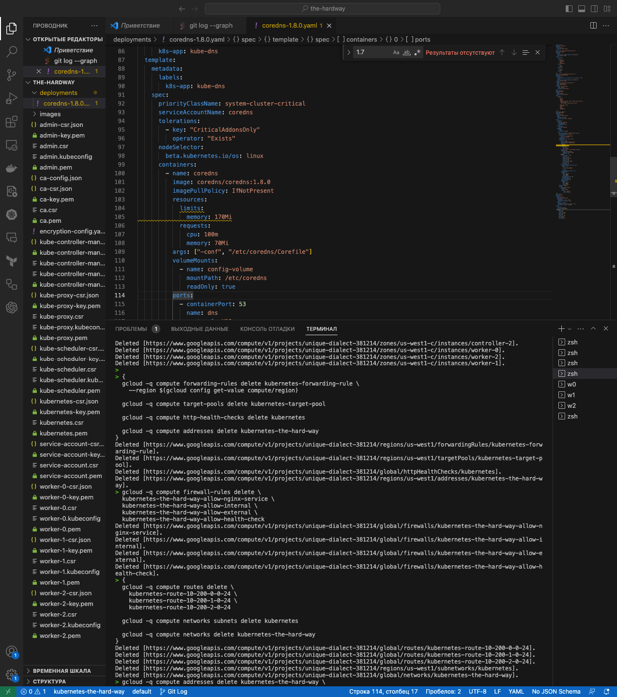

## Learning Kubernetes: The Hard Way

"The Hard Way" is an educational approach proposed by Kelsey Hightower to learn Kubernetes fundamentals by manually setting up a cluster from scratch. It offers several benefits, including:

- **Understanding Kubernetes**: Gain a deep understanding of how Kubernetes works, including its components, communication, and cluster interactions.
- **Skill and Knowledge Enhancement**: Develop practical skills in managing Kubernetes by creating configurations, networking, and security setups.
- **Security Awareness**: Learn about authentication, authorization, encryption, and network security.
- **Troubleshooting Readiness**: Be prepared to handle and troubleshoot issues that may arise during Kubernetes configuration and usage.
- **Assessing the Big Picture**: Gain insights into Kubernetes architecture and how it fits your specific needs.

It's important to note that "The Hard Way" is just one way to learn Kubernetes and may not be suitable for everyone. Explore other learning paths and resources based on your preferences and requirements.

